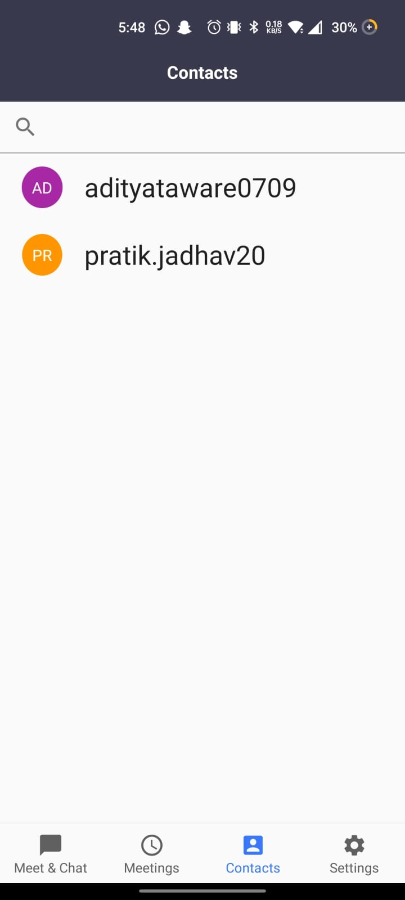

# Zoom
Developed an android application cloning the features of Zoom, the popular video conferencing app, plus adding extra features such as chat, audio call.

## Main idea
The main idea of this application is to try and apply my android development skills to develop something that can boost my interest in android development.
- **Video Conference**: Users can create or join a meeting/conference using the meeting id.
- **Video Call**: Make one-on-one call to your contacts in the app.
- **Audio Call**: Audio call any one from your contacts using VoIP.
- **Chat**: Users will be able to chat with their contacts just like Whatsapp. 

Meet & Chat (Home Screen)            |  Meetings   |  Contacts   | Settings
:-------------------------:|:-------------------------:|:-------------------------:|:-------------------------:
  |     |   |  

Video Call   | Chat 
:-------------------------:|:-------------------------:
  |   

## Software Requirements

- Operating System for app to work: **Android**
- Programming Languages Used: **Java**
- **XML** is used for front end
- **Firebase CloudStore** is used to store user data.
- **Video conferencing** and **chat** feature were implemented using **Quickblox** and **Agora SDK**, while authentication was done using **Firebase**.
- This project is made using **Android Studio IDE**

